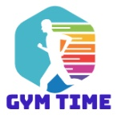

[![LinkedIn][linkedin-shield]][linkedin-url]

<br />
<p align="center">
  <a href="https://github.com/shakkky/gym-time-platform">
    
  </a>

  <h3 align="center">Gym Time Platform</h3>

  <p align="center">
    Shakeel Mohammed - Code Challenge
    <br />
    <a href="https://github.com/shakkky/gym-time-platform"><strong>Explore the docs »</strong></a>
    <br />
    <br />
    <a href="http://gym-time-platform-452098011534.s3-website-ap-southeast-2.amazonaws.com">View Demo</a>
  </p>
</p>


<!-- TABLE OF CONTENTS -->
<details open="open">
  <summary>Table of Contents</summary>
  <ol>
    <li>
      <a href="#about-the-project">About The Project</a>
      <ul>
        <li><a href="#built-with">Built With</a></li>
      </ul>
    </li>
    <li>
      <a href="#getting-started">Getting Started</a>
      <ul>
        <li><a href="#prerequisites">Prerequisites</a></li>
        <li><a href="#installation">Installation</a></li>
      </ul>
    </li>
    <li><a href="#usage">Usage</a></li>
    <li><a href="#roadmap">Roadmap</a></li>
    <li><a href="#contact">Contact</a></li>
    <li><a href="#acknowledgements">Acknowledgements</a></li>
  </ol>
</details>

## About The Project

[![Product Name Screen Shot][product-screenshot]](http://gym-time-platform-452098011534.s3-website-ap-southeast-2.amazonaws.com)

This a self-serve signup flow for fictional business - Gym Time. The user flow of the module is as follows:

The user flow of the module is as follows:
* A user is presented with a sign-up page and ready to sign up. 
* User fills up the form. All fields are mandatory. The form is validated on the frontend to ensure all fields are valid. i.e Email is a valid format and passwords match. If the form is invalid, it indicates the error at the field level, and prevents the form from being submitted.
* The backend service takes the request and services it.
* The sign-up data is stored in a database.
* The backend service sends an activation email to user for confirming their email and activates the
account.
* External email senders such as SendGrid and MailGun are used for sending the activation email. Both services are utilised to achieve high availability. If one service is temporarily down, the backend
service is be able to switch to another service automatically without human intervention.
* The frontend should reflect the status update.
* Once the flow is complete, the frontend shows a verification screen.

### Built With

The application has been built to be run locally in Docker containers, and as services in AWS Lambda and S3.
* [React.js](https://reactjs.org)
* [Express.js](https://expressjs.com)
* [Docker](https://www.docker.com)
* [Serverless](https://www.serverless.com)
* [LocalStack](https://localstack.cloud)

## Getting Started

To get a local copy up and running follow these simple steps.

### Prerequisites

This is an example of how to list things you need to use the software and how to install them:
1. Ensure Docker is installed on local machine:
    ```sh
    docker version
    ```
    If Docker is not installed, follow [these](https://docs.docker.com/get-docker) steps.

2. Ensure AWS CLI is installed on local machine:
    ```sh
    aws --version
    ```
    If AWS CLI is not installed, follow [these](https://docs.aws.amazon.com/cli/latest/userguide/cli-chap-install.html) steps.

3. Get free SendGrid API keys by following [these](https://sendgrid.com/docs/for-developers/sending-email/api-getting-started) steps.

4. Get free MailGun API keys creating an account and following [these](https://help.mailgun.com/hc/en-us/articles/203380100-Where-Can-I-Find-My-API-Key-and-SMTP-Credentials-) steps.

### Installation & Setup

1. Clone the repo
    ```sh
    git clone https://github.com/shakkky/gym-time-platform.git
    ```
2. Enter your API keys, Mailgun domain, and verified email address in `.env` file
    ```sh
    SENDGRID_API_KEY=<SG_API_KEY_HERE>
    MAILGUN_API_KEY=<MG_API_KEY_HERE>
    MAILGUN_DOMAIN=<MG_DOMAIN_HERE>
    SRC_EMAIL_ADDRESS=<your_verified_email@example.com>
    ```

## Usage
The application can be run locally, as well as deployed to AWS. When running locally, a docker container running LocalStack is spun up and used by REST service rather than AWS hosted services to allow for localized development and testing. Note - Emails may be blocked by your mail server. If you're unable to receive an email, please try using a different account.

Running Locally:
1. Build docker containers using docker-compose build:
    ```sh
    docker-compose build
    ```
2. Start docker containers using docker-compose up:
    ```sh
    docker-compose up
    ```
3. The application is now running on your local machine. Navigate to react frontend hosted in Docker container: http://localhost:3000

Note, here are a few commands that are useful for viewing DynamoDB table running in LocalStack:
* Scan "accounts" table:
    ```sh
    aws --region=ap-southeast-2 --endpoint-url=http://localhost:4566 dynamodb scan --table-name=accounts
    ```
* Delete "accounts" table:
    ```sh
    aws --region=ap-southeast-2 --endpoint-url=http://localhost:4566 dynamodb delete-table --table-name=accounts
    ```

Deploy to AWS:
1. Execute deploy-dev.sh bash script:
    ```sh
    bash deploy-dev.sh
    ```
2. The bash script outputs the URL to the S3 website:
    ```sh
    Client Endpoint: <YOUR CLIENT ENDPOINT>
    ```

Remove from AWS:
1. Execute destroy-dev.sh bash script:
    ```sh
    bash destroy-dev.sh
    ```

## Roadmap
There are a few improvements I would like to make:
* Use "supertest" to simluate HTTP requests during testing to run more service-level/functional tests.
* Implement more thorough tests by mocking AWS services using LocalStack or Sinon.
* Implement a more scalable way to handle AWS deployments. Bash script does not offer the same flexibility as using sls commands directly.

## License
Distributed under the MIT License. See `LICENSE` for more information.

## Contact
Shakeel Mohammed - [LinkedIn](https://www.linkedin.com/in/shakeel-mohammed-5b046a183/) - shakeel.mohammed1@hotmail.com
Project Link: [https://github.com/shakkky/gym-time-platform](https://github.com/shakkky/gym-time-platform)

## Acknowledgements
* [React Bootstrap](https://react-bootstrap.github.io)


[linkedin-shield]: https://img.shields.io/badge/-LinkedIn-black.svg?style=for-the-badge&logo=linkedin&colorB=555
[linkedin-url]: https://www.linkedin.com/in/shakeel-mohammed-5b046a183/
[product-screenshot]: images/screenshot.jpg